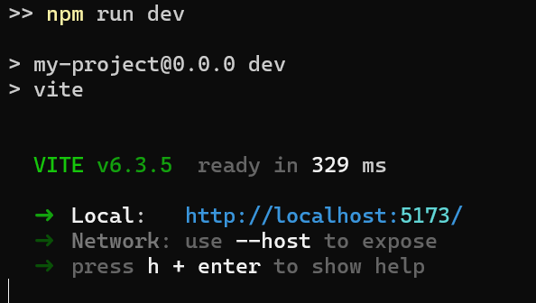
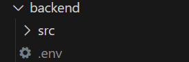
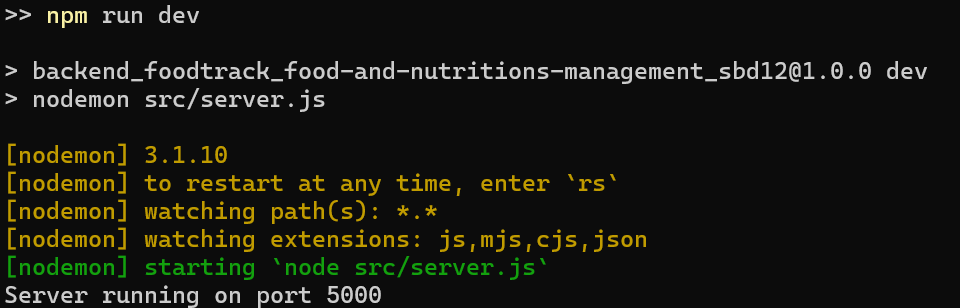
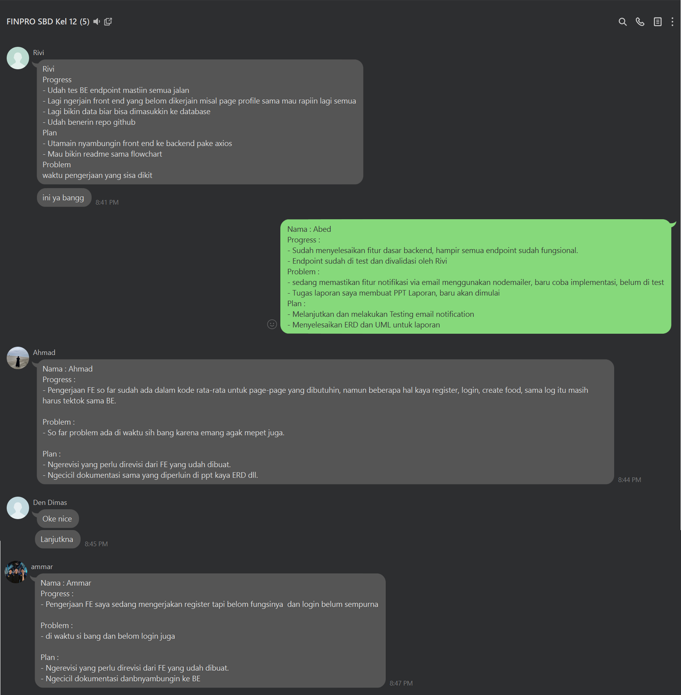

### Descriptions

# 💻 Tech Stack:

       

# 📊 Diagrams

## UML

## ERD

## FlowChart

# 💻 Installation Guide

Clone this repository

```
git clone https://github.com/ssantario/FoodTrack_Food-And-Nutritions-Management_SBD12.git
```

## Frontend

- Make sure you are on the right folder

  ```bash
  cd frontend
  ```

- Run npm install to install all dependencies
  ```
   npm install
  ```
- To test the installation result run
  ```
  npm run dev
  ```
- It should look like this : 
  

## Backend

- Make sure you are on the right folder

  ```bash
  cd backend
  ```
- Run npm install to install all dependencies
  ```
   npm install
  ```
- Create your `.env` file in the front-end root, the same hierarchy as `src`
  

- Your .env should contain these variables : 
    ```bash
    # Server
    PORT=5000 #this is the default, adjust to your needs
    NODE_ENV=development

    # Database
    DATABASE_URL=<database-string>

    # JWT
    JWT_SECRET=<your-jwt-secret>
    JWT_EXPIRES_IN=7d #adjust to your needs

    # Email
    EMAIL_USER=<sender-email>
    EMAIL_PASSWORD=<app-password>
    EMAIL_SERVICE=gmail #adjust to your needs

    # Nutrition API (Nutritionix)
    NUTRITIONIX_APP_ID=<app-id>
    NUTRITIONIX_API_KEY=<api-key>
    NUTRITION_API_URL=https://trackapi.nutritionix.com/v2/natural/nutrients

    # App URL (for email links)
    APP_URL=http://localhost:5173 #this is the default, adjust to your needs
    ```
- To test the installation result run
  ```
   npm run dev
  ```
- It should look like this :
  
  
# 💻 Progress Report (text-based):


