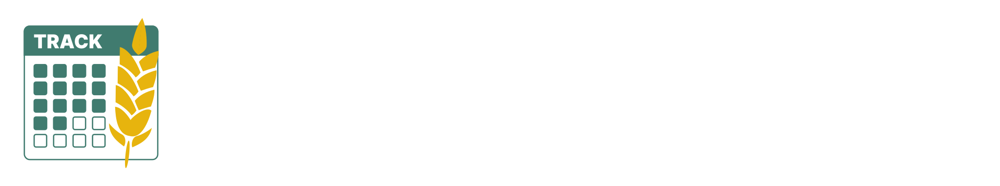
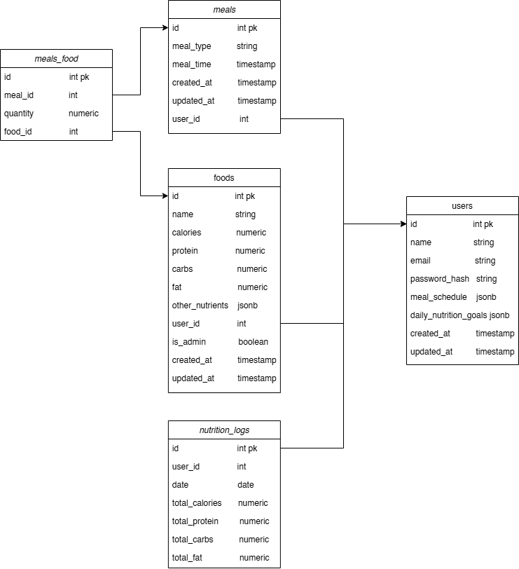
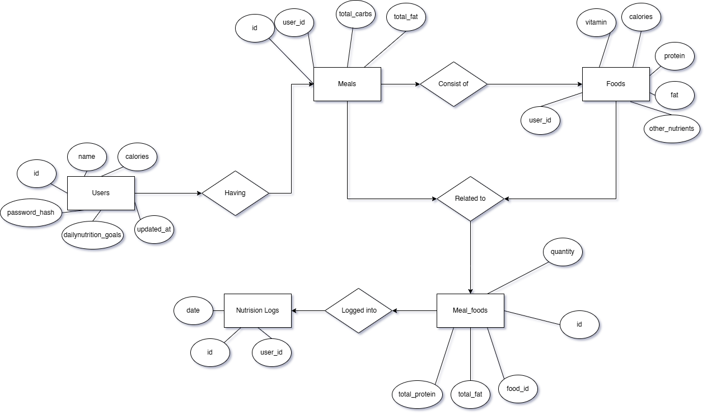
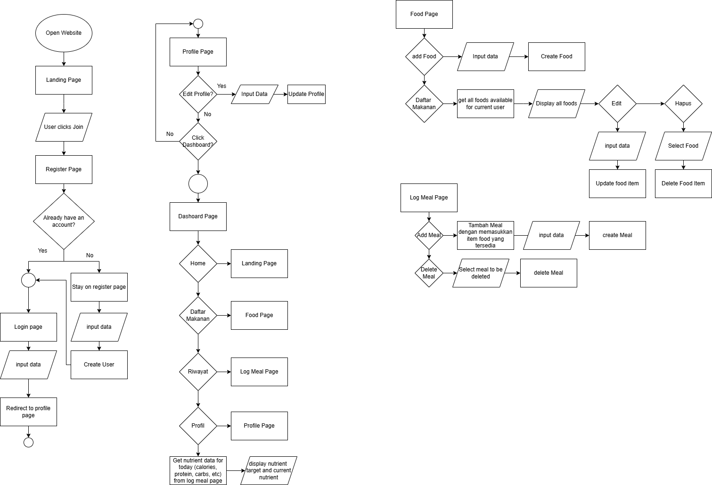
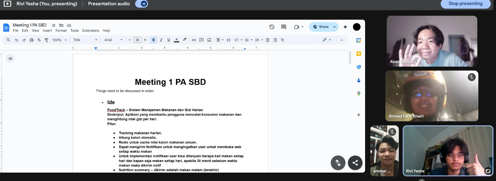

## Description
FoodTrack
FoodTrack is a nutrition and food management system designed to help users easily monitor and improve their daily eating habits. The system consists of four main components: User, Profile, and Dashboard.

The User interacts with FoodTrack by registering and logging in to the platform. Users can log their daily meals, set personal nutrition targets, and view their meal history. The Profile section allows users to manage their personal information and customize their nutrition goals and meal schedules for optimal health.

The Dashboard provides users with a comprehensive overview of their daily nutritional intake, progress toward their goals, and helpful tips to maintain a balanced diet. 

Users can add their own foods, record what they eat, and track their progress over time. All meal and nutrition data is securely stored and can be accessed for review and analysis. FoodTrack aims to simplify healthy living by making nutrition tracking intuitive, personalized, and actionable.

# 💻 Tech Stack:

       

# 📊 Diagrams

## UML


## ERD


## FlowChart


# 💻 Installation Guide

Clone this repository

```
git clone https://github.com/ssantario/FoodTrack_Food-And-Nutritions-Management_SBD12.git
```

## Frontend

- Make sure you are on the right folder

  ```bash
  cd frontend
  ```

- Run npm install to install all dependencies
  ```
   npm install
  ```
- To test the installation result run
  ```
  npm run dev
  ```
- It should look like this :

  

## Backend

- Make sure you are on the right folder

  ```bash
  cd backend
  ```
- Run npm install to install all dependencies
  ```
   npm install
  ```
- Create your `.env` file in the front-end root, the same hierarchy as `src`
  
  

- Your .env should contain these variables : 
    ```bash
    # Server
    PORT=5000 #this is the default, adjust to your needs
    NODE_ENV=development

    # Database
    DATABASE_URL=<database-string>

    # JWT
    JWT_SECRET=<your-jwt-secret>
    JWT_EXPIRES_IN=7d #adjust to your needs

    # Email
    EMAIL_USER=<sender-email>
    EMAIL_PASSWORD=<app-password>
    EMAIL_SERVICE=gmail #adjust to your needs

    # Nutrition API (Nutritionix)
    NUTRITIONIX_APP_ID=<app-id>
    NUTRITIONIX_API_KEY=<api-key>
    NUTRITION_API_URL=https://trackapi.nutritionix.com/v2/natural/nutrients

    # App URL (for email links)
    APP_URL=http://localhost:5173 #this is the default, adjust to your needs
    ```
- To test the installation result run
  ```
   npm run dev
  ```
- It should look like this :
  
  
  
# 💻 Progress Report (text-based):



